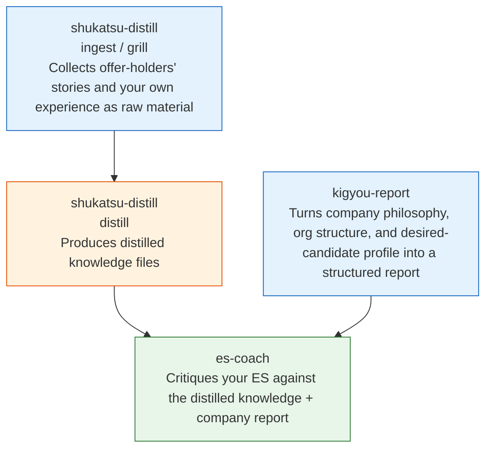

# es-coach-skills — Claude Code Skills for Japanese Job-Hunting (Shukatsu) ES Coaching

**English** | [简体中文](README.zh.md) | [日本語](README.md)

A three-skill set for [Claude Code](https://claude.com/claude-code) that automates ES (entry sheet / cover letter) preparation for Japanese new-graduate recruiting (`就活`/shukatsu). It distills successful patterns from offer-holders' experience, uses that as grounds to critique your ES, and cross-checks company philosophy / desired-candidate profiles via structured company research reports.

> This is the skill layer extracted from a personal job-hunting automation project. It contains none of your ES content, target companies, or vault data — everything accumulates in your own Obsidian vault.

## How the three skills relate



| Skill | Role |
|-------|------|
| `es-coach` | Interactive ES critique (fact-check → 5-axis scoring → revision loop → sign-off). Grounded in distilled knowledge, the company report, and your own past episodes |
| `shukatsu-distill` | Four modes: `ingest` (bring in offer-holders' accounts), `distill` (extract success patterns), `coach mock` (mock interview), `grill` (reverse-interview to turn your own experience into material) |
| `kigyou-report` | Turns a named company into a fixed 12-section structured report (org/division map, company philosophy, ES tactics, etc.) |

All three read and write an Obsidian vault; every vault path resolves through `vault.paths.env`, a **single registry file** (so reorganizing your vault never requires editing skill prose).

## Requirements

- [Claude Code](https://claude.com/claude-code) (Skills feature)
- Obsidian (or an equivalent Markdown vault)
- Python 3 (needed to run `tools/count_chars.py` and `tools/experience_inventory_sync.py`; requires `pyyaml`)

## Setup

```bash
# 1. Clone
git clone <this-repo-url> es-coach-skills
cd es-coach-skills

# 2. Point an env var at this repo (add to your shell startup file)
echo 'export SHUKATSU_SKILLS_ROOT="'"$(pwd)"'"' >> ~/.zshrc
source ~/.zshrc

# 3. Configure your vault path
cp vault.paths.example.env vault.paths.env
$EDITOR vault.paths.env   # point it at your actual Obsidian vault

# 4. Make Claude Code aware of the skills (copy or symlink both work)
mkdir -p ~/.claude/skills
ln -s "$SHUKATSU_SKILLS_ROOT/skills/es-coach"         ~/.claude/skills/es-coach
ln -s "$SHUKATSU_SKILLS_ROOT/skills/shukatsu-distill" ~/.claude/skills/shukatsu-distill
ln -s "$SHUKATSU_SKILLS_ROOT/skills/kigyou-report"    ~/.claude/skills/kigyou-report

# 5. Python dependency
pip install pyyaml
```

After setup, start with `/shukatsu-distill ingest` in Claude Code (feed it offer-holders' stories, YouTube transcripts, job-hunting site articles → auto-distilled → critique your ES with `/es-coach`).

## Usage

```
/shukatsu-distill ingest      Bring in offer-holders' accounts/articles as raw material
/shukatsu-distill distill     Extract success patterns from material into distilled knowledge
/shukatsu-distill grill       Reverse-interview to dig up and materialize your own experience
/shukatsu-distill coach mock  Mock interview
/kigyou-report <company>       Generate a company research report
/es-coach                     Interactive ES critique
```

## Sample output

`examples/` holds fabricated-data samples so you can see actual output shape without first setting up a vault:

| File | Content |
|------|---------|
| [examples/es-coach-sample-critique.md](examples/es-coach-sample-critique.md) | Full critique report for a fictional ES |
| [examples/shukatsu-distill-sample-chishiki.md](examples/shukatsu-distill-sample-chishiki.md) | What a distilled-knowledge file looks like after `distill` runs |
| [examples/kigyou-report-sample-excerpt.md](examples/kigyou-report-sample-excerpt.md) | Company report excerpt (of the full 12 sections) |

## Repository layout

```
es-coach-skills/
├── skills/
│   ├── es-coach/SKILL.md            Interactive ES critique (Phase 0–8 flow)
│   ├── shukatsu-distill/SKILL.md    ingest / distill / coach mock / grill (4 modes)
│   └── kigyou-report/SKILL.md       Company report generation (fixed 12 sections)
├── tools/
│   ├── count_chars.py               ES character/word counter (offloads counting from the LLM)
│   ├── experience_inventory_sync.py Recomputes episode usage from critique logs
│   └── vault_paths.py               Resolver for vault.paths.env
├── examples/                        Fabricated-data sample output (table above)
├── vault.paths.example.env          Vault path registry template
└── README.md / README.zh.md / README.en.md
```

## How material actually accumulates (two supply paths)

This system doesn't get smarter by itself — you drive two loops that grow the distilled knowledge and personal-experience material inside the vault pointed to by `vault.paths.env`. This repo contains only the logic (skill prompts and helper scripts); none of your actual company-selection content or ES data.

### ① Personal experience (`素材/本人/`) — run `grill`, or keep a diary yourself

- The easiest path is `/shukatsu-distill grill`: Claude reverse-interviews you and extracts material.
- Keeping a regular **diary/journal in Obsidian** is also a valid supply path — jot down self-analysis, gakuchika candidates, shifts in values, unpolished.
  - For `distill` mode to pick these up automatically, copy the relevant diary passages into a file under `VAULT_SHUKATSU_SOZAI_SELF` (`素材/本人/`) with the same frontmatter `grill` output uses (`source_type: 本人`, `distilled: false`, etc.) — `distill` finds new material by grepping for `distilled: false`.
  - Without that frontmatter, `es-coach`'s Phase 4 will still `ls` and read `素材/本人/` directly, but `distill` won't fold it into the knowledge files.

### ② Offer-holder patterns (distilled knowledge) — run `shukatsu-distill ingest` to pull in web material

- Feed `/shukatsu-distill ingest` a YouTube URL, a job-hunting site article URL, or pasted text; it fetches the content via defuddle/WebFetch and saves it under `素材/YouTube/` or `素材/就活サイト/`.
- Saving **automatically triggers `distill` mode without asking**, folding success patterns into the knowledge files (e.g. `蒸留知識/内定之路/金融.md`).
- In practice: every time you find an offer-holder's YouTube video or article, run `ingest` on it.

## License

MIT. See `LICENSE`.
