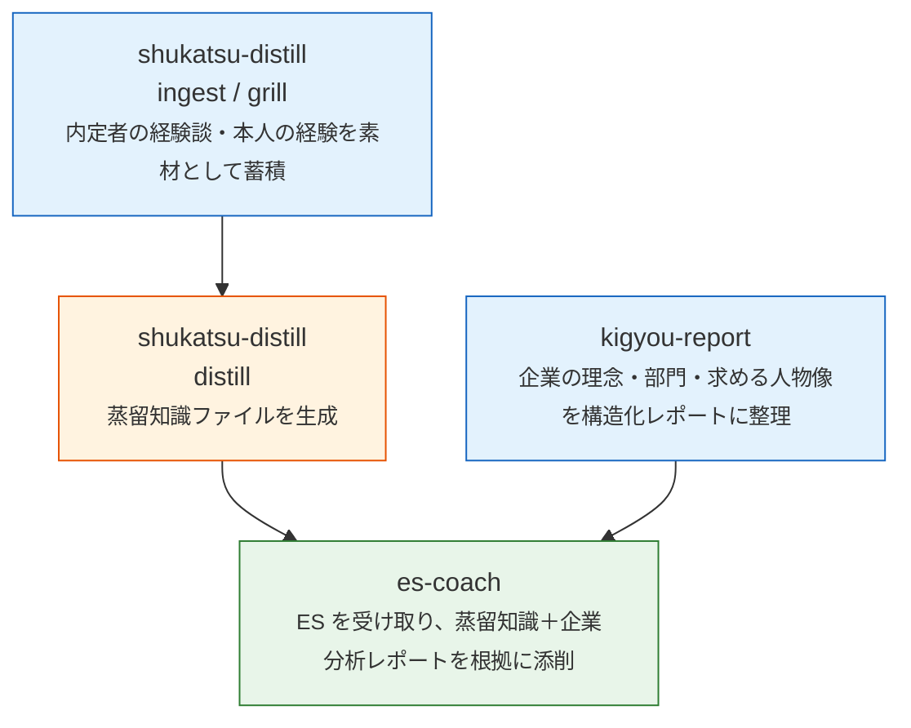

# es-coach-skills — 日本就活 ES 対話コーチ用 Claude Code Skills

[English](README.en.md) | [简体中文](README.zh.md) | **日本語**

日本就活（新卒採用）の ES（エントリーシート）対策を、[Claude Code](https://claude.com/claude-code) の Skill として自動化する3点セット。内定者の経験談から成功パターンを蒸留（distill）し、それを根拠に ES を添削し、企業分析レポートで理念・求める人物像との適合を突き合わせる。

> これは個人の就活自動化プロジェクトから抽出した Skill 本体です。あなたの ES 内容・企業情報・vault の中身は含まれていません——すべてあなた自身の Obsidian vault に蓄積されます。

## 3つの Skill の関係



| Skill | 役割 |
|-------|------|
| `es-coach` | ES 文を対話的に添削（事実確認 → 評価 → 修正ループ → サインオフ）。蒸留知識・企業分析レポート・本人の過去エピソードを根拠にする |
| `shukatsu-distill` | `ingest`（内定者体験談の取り込み）/ `distill`（成功パターンの抽出）/ `coach mock`（模擬面接）/ `grill`（逆面接で本人の経験を素材化）の4モード |
| `kigyou-report` | 指定企業を12セクション固定の構造化レポートに整理（部門マップ、企業理念、ES 攻略法など） |

3つとも Obsidian vault にデータを読み書きする前提で、vault 内のパスは `vault.paths.env` という**唯一のレジストリファイル**経由で解決する（vault の再編成をしても Skill 本文を書き換えずに済む設計）。

## 必要なもの

- [Claude Code](https://claude.com/claude-code)（Skills 機能）
- Obsidian（または同等の Markdown vault）
- Python 3（`tools/count_chars.py` と `tools/experience_inventory_sync.py` の実行に必要。`pyyaml` が要る）

## セットアップ

```bash
# 1. クローン
git clone <this-repo-url> es-coach-skills
cd es-coach-skills

# 2. このリポジトリの場所を環境変数として設定する（シェルの起動ファイルに追記）
echo 'export SHUKATSU_SKILLS_ROOT="'"$(pwd)"'"' >> ~/.zshrc
source ~/.zshrc

# 3. vault のパスを設定する
cp vault.paths.example.env vault.paths.env
$EDITOR vault.paths.env   # あなたの Obsidian vault の実際のパスに書き換える

# 4. Skill を Claude Code に認識させる（コピーでもシンボリックリンクでも可）
mkdir -p ~/.claude/skills
ln -s "$SHUKATSU_SKILLS_ROOT/skills/es-coach"        ~/.claude/skills/es-coach
ln -s "$SHUKATSU_SKILLS_ROOT/skills/shukatsu-distill" ~/.claude/skills/shukatsu-distill
ln -s "$SHUKATSU_SKILLS_ROOT/skills/kigyou-report"    ~/.claude/skills/kigyou-report

# 5. Python 依存関係
pip install pyyaml
```

セットアップ後、Claude Code で `/shukatsu-distill ingest` から始めるのがおすすめ（内定者の体験談・YouTube 動画の文字起こし・就活サイト記事などを投入 → 自動で蒸留 → `/es-coach` で ES 添削、という流れ）。

## 使い方

```
/shukatsu-distill ingest      内定者の体験談・記事を素材として取り込む
/shukatsu-distill distill     素材から成功パターンを抽出・蒸留知識に反映
/shukatsu-distill grill       逆面接形式であなた自身の経験を掘り起こして素材化
/shukatsu-distill coach mock  模擬面接
/kigyou-report <企業名>        企業分析レポートを生成
/es-coach                     ES を対話的に添削
```

## サンプル出力

実際にどんな出力になるか、架空データで作った例を `examples/` に置いている：

| ファイル | 内容 |
|---------|------|
| [examples/es-coach-sample-critique.md](examples/es-coach-sample-critique.md) | 架空のESに対する添削レポートの実例 |
| [examples/shukatsu-distill-sample-chishiki.md](examples/shukatsu-distill-sample-chishiki.md) | `distill` が育てる蒸留知識ファイルの中身 |
| [examples/kigyou-report-sample-excerpt.md](examples/kigyou-report-sample-excerpt.md) | 企業分析レポート（12セクション中の抜粋） |

## リポジトリ構成

```
es-coach-skills/
├── skills/
│   ├── es-coach/SKILL.md            ES 対話添削（Phase 0〜8 のフロー）
│   ├── shukatsu-distill/SKILL.md    ingest / distill / coach mock / grill の4モード
│   └── kigyou-report/SKILL.md       企業分析レポート生成（12セクション固定）
├── tools/
│   ├── count_chars.py               ES 字数・語数カウンタ（LLM の目測を使わない）
│   ├── experience_inventory_sync.py 添削ログから経験の使用状況を自動集計
│   └── vault_paths.py               vault.paths.env の解析器
├── examples/                        架空データによるサンプル出力（上表）
├── vault.paths.example.env          vault パスレジストリのテンプレート
└── README.md / README.zh.md / README.en.md
```

## 素材はどうやって増えるか（2つの補給ルート）

このシステムは放っておいても勝手に賢くなるわけではない。以下の2つを自分で回すことで、`vault.paths.env` で指定した vault 内に蒸留知識・本人素材が育っていく。このリポジトリにはロジック（Skill の指示文とヘルパースクリプト）だけが入っており、あなたの企業選考の内容・ES の実データは一切含まれない。

### ① 本人の経験（素材/本人/）— grill か、自分で日記を書くか

- `/shukatsu-distill grill` で Claude との一問一答（逆面接）から抽出するのが最も手軽な方法。
- それに加えて、**普段から Obsidian に日記・日誌をつけておく**のも有効な補給ルート。自己分析・ガクチカ候補・価値観の変化などを飾らずに書き溜めておく。
  - `distill` モードに自動で拾わせたい場合は、日記の該当部分を `VAULT_SHUKATSU_SOZAI_SELF`（素材/本人/）配下のファイルとしてコピーし、`grill` 出力と同じ frontmatter（`source_type: 本人` / `distilled: false` など）を付けておく（`distilled: false` の grep で拾われる仕組みのため）。
  - frontmatter を付けなくても `es-coach` の Phase 4 は `素材/本人/` 配下を `ls` して直接読みに行くが、蒸留知識ファイルへの反映（`distill`）は frontmatter がないと拾われない。

### ② 内定者パターン（蒸留知識）— shukatsu-distill ingest でネットの情報を取り込む

- `/shukatsu-distill ingest` に YouTube の URL・就活サイトの記事 URL・貼り付けテキストを渡すと、defuddle / WebFetch で本文を取得し、`素材/YouTube/` または `素材/就活サイト/` に保存される。
- 保存後は**確認なしで自動的に `distill` モードが走り**、蒸留知識ファイル（`蒸留知識/内定之路/金融.md` 等）に成功パターンとして反映される。
- つまり日常的な運用は、内定者の情報源（YouTube 動画・就活サイト記事）を見つけるたびに `ingest` を回す、というシンプルな繰り返しになる。

## ライセンス

MIT. `LICENSE` 参照。
