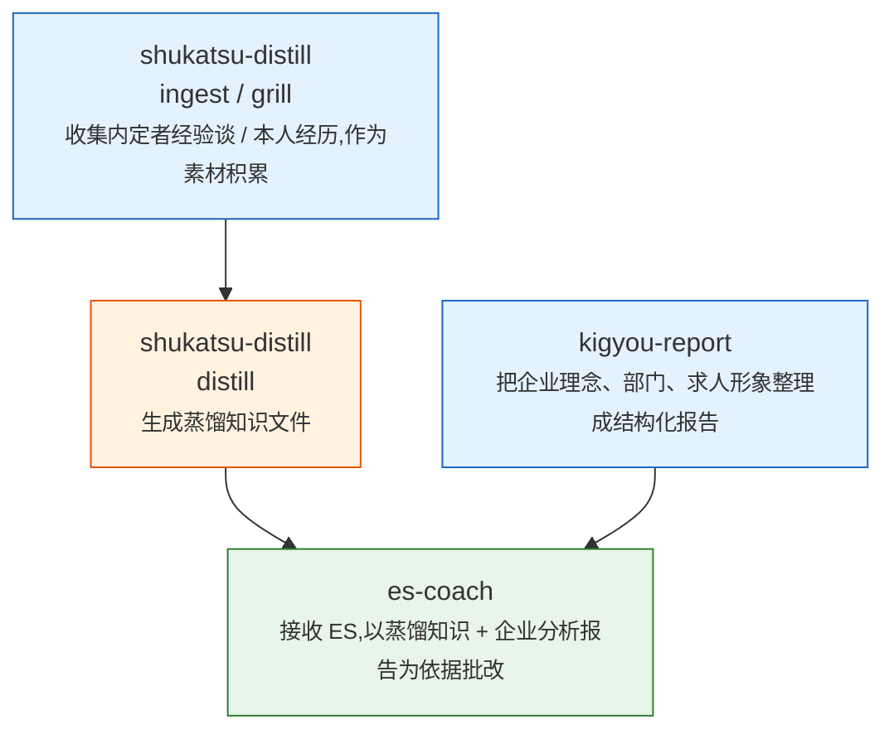

# es-coach-skills — 日本就活 ES 对话教练 Claude Code Skills

[English](README.en.md) | **简体中文** | [日本語](README.md)

面向日本就活(应届生招聘)ES(自我推荐信/エントリーシート)对策的三件套 [Claude Code](https://claude.com/claude-code) Skill。从内定者的经验谈中蒸馏成功模式,以此为依据批改 ES,并用企业分析报告核对企业理念、求人形象与 ES 内容是否契合。

> 这是从个人就活自动化项目中抽取出的 Skill 本体。不包含你的 ES 内容、企业信息或 vault 数据——一切都会积累在你自己的 Obsidian vault 里。

## 三个 Skill 的关系



| Skill | 作用 |
|-------|------|
| `es-coach` | 对话式批改 ES(事实核查 → 评价 → 修改循环 → 定稿签字)。以蒸馏知识、企业分析报告、本人过往经历为依据 |
| `shukatsu-distill` | 四种模式:`ingest`(录入内定者经验谈)/ `distill`(提炼成功模式)/ `coach mock`(模拟面试)/ `grill`(反向面试,挖掘并素材化本人经历) |
| `kigyou-report` | 把指定企业整理成固定 12 章节的结构化报告(部门地图、企业理念、ES 攻略法等) |

三者都以读写 Obsidian vault 为前提,vault 内的路径统一经由 `vault.paths.env` 这一**唯一注册表文件**解析(即使 vault 目录重新整理,也不用改 Skill 正文)。

## 前置依赖

- [Claude Code](https://claude.com/claude-code)(Skills 功能)
- Obsidian(或同等的 Markdown vault)
- Python 3(运行 `tools/count_chars.py` 和 `tools/experience_inventory_sync.py` 需要,依赖 `pyyaml`)

## 安装步骤

```bash
# 1. 克隆仓库
git clone <this-repo-url> es-coach-skills
cd es-coach-skills

# 2. 把本仓库位置设为环境变量(写入 shell 启动文件)
echo 'export SHUKATSU_SKILLS_ROOT="'"$(pwd)"'"' >> ~/.zshrc
source ~/.zshrc

# 3. 配置 vault 路径
cp vault.paths.example.env vault.paths.env
$EDITOR vault.paths.env   # 改成你自己 Obsidian vault 的实际路径

# 4. 让 Claude Code 识别这几个 Skill(复制或软链接都可以)
mkdir -p ~/.claude/skills
ln -s "$SHUKATSU_SKILLS_ROOT/skills/es-coach"         ~/.claude/skills/es-coach
ln -s "$SHUKATSU_SKILLS_ROOT/skills/shukatsu-distill" ~/.claude/skills/shukatsu-distill
ln -s "$SHUKATSU_SKILLS_ROOT/skills/kigyou-report"    ~/.claude/skills/kigyou-report

# 5. Python 依赖
pip install pyyaml
```

配置完成后,建议在 Claude Code 里从 `/shukatsu-distill ingest` 开始(投入内定者经验谈、YouTube 视频文字稿、就活网站文章等 → 自动蒸馏 → 用 `/es-coach` 批改 ES,形成完整流程)。

## 使用方法

```
/shukatsu-distill ingest      录入内定者经验谈/文章作为素材
/shukatsu-distill distill     从素材中提炼成功模式,写入蒸馏知识
/shukatsu-distill grill       以反向面试的形式挖掘你自己的经历并素材化
/shukatsu-distill coach mock  模拟面试
/kigyou-report <企业名>        生成企业分析报告
/es-coach                     对话式批改 ES
```

## 样例输出

`examples/` 目录下放了几份用虚构数据生成的样例,让你不用先搭好 vault 就能看到实际输出长什么样:

| 文件 | 内容 |
|------|------|
| [examples/es-coach-sample-critique.md](examples/es-coach-sample-critique.md) | 针对一份虚构 ES 的完整批改报告 |
| [examples/shukatsu-distill-sample-chishiki.md](examples/shukatsu-distill-sample-chishiki.md) | `distill` 积累起来的蒸馏知识文件长什么样 |
| [examples/kigyou-report-sample-excerpt.md](examples/kigyou-report-sample-excerpt.md) | 企业分析报告(12 章节中的节选) |

## 仓库结构

```
es-coach-skills/
├── skills/
│   ├── es-coach/SKILL.md            ES 对话批改(Phase 0~8 流程)
│   ├── shukatsu-distill/SKILL.md    ingest / distill / coach mock / grill 四种模式
│   └── kigyou-report/SKILL.md       企业分析报告生成(固定 12 章节)
├── tools/
│   ├── count_chars.py               ES 字数/词数计数器(不依赖 LLM 目测)
│   ├── experience_inventory_sync.py 从批改日志自动汇总经历使用情况
│   └── vault_paths.py               vault.paths.env 的解析器
├── examples/                        虚构数据的样例输出(见上表)
├── vault.paths.example.env          vault 路径注册表模板
└── README.md / README.zh.md / README.en.md
```

## 素材怎么积累起来(两条补给路径)

这套系统不会放着不管就自己变聪明。需要你自己去跑下面两件事,`vault.paths.env` 里指定的 vault 中的蒸馏知识、本人素材才会逐步长起来。本仓库只包含逻辑(Skill 的指令文本和辅助脚本),不含你任何具体的企业选考内容或 ES 实际数据。

### ① 本人经历(素材/本人/)——跑 grill,或者自己写日记

- 最省事的方式是 `/shukatsu-distill grill`,靠 Claude 一问一答(反向面试)帮你挖出来。
- 除此之外,**平时在 Obsidian 里写日记/日志**也是一条有效的补给路径。自我分析、ガクチカ候补、价值观变化之类的内容不用刻意打磨,随手记下来就行。
  - 如果想让 `distill` 模式自动捡到这些内容,需要把日记里相关的部分复制成 `VAULT_SHUKATSU_SOZAI_SELF`(素材/本人/)目录下的一个文件,并配上和 `grill` 输出一样的 frontmatter(`source_type: 本人` / `distilled: false` 等)——因为 distill 是靠 grep `distilled: false` 来发现新素材的。
  - 不配 frontmatter 的话,`es-coach` 的 Phase 4 依然会直接 `ls` 素材/本人/ 目录去读,但不会被 `distill` 汇入蒸馏知识文件(因为没有 frontmatter 标记)。

### ② 内定者模式(蒸馏知识)——跑 shukatsu-distill ingest 抓取网上信息

- 把 YouTube 链接、就活网站文章链接、或直接粘贴的文本丢给 `/shukatsu-distill ingest`,它会用 defuddle / WebFetch 抓取正文,存进 `素材/YouTube/` 或 `素材/就活サイト/`。
- 保存后**会不经确认自动跑一次 `distill` 模式**,把成功模式汇入蒸馏知识文件(如 `蒸留知識/内定之路/金融.md`)。
- 也就是说日常的操作很简单:每次发现一个内定者的信息源(YouTube 视频、就活网站文章),就跑一次 `ingest`。

## 许可证

MIT。见 `LICENSE`。
