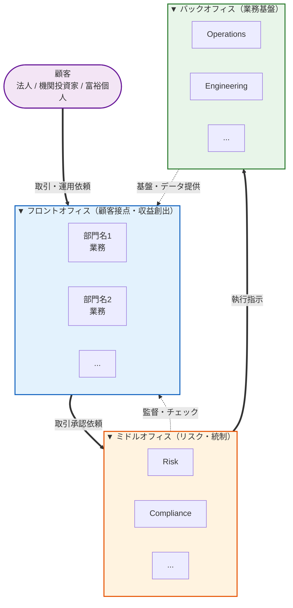

# kigyou-report — 就活企業分析レポート生成 skill

ユーザーが指定した企業を 12 セクション固定の構造化レポートに蒸留し、Obsidian Vault の「企業分析报告/」に保存する skill（公開情報が薄い企業のみ簡易 5 版に縮退。エッジケース参照）。

## パス解決（正本はレジストリ）

パスの**唯一の定義元**は `$SHUKATSU_SKILLS_ROOT/vault.paths.env`（このリポジトリをクローンした場所を指す環境変数。README のセットアップ手順を参照）。このスキルで使うキー：

```
VAULT_KIGYOU_REPORTS     → 企業分析报告/（レポート保存先）
VAULT_SHUKATSU_DISTILL   → 就活蒸留システムの根目録（素材参照元は 素材/ 配下、蒸留知識参照元は 蒸留知識/ 配下）
VAULT_ROOT               → vault 根（Step 2 の grep 起点）

ファイル名形式    → 【<企業名>】企業分析レポート.md
参考フォーマット  → $VAULT_KIGYOU_REPORTS/【ゴールドマン・サックス】企業分析レポート.md
```

解決方法：`source $SHUKATSU_SKILLS_ROOT/vault.paths.env` してから各キーを参照する。**本文にパスを直書きしない**（vault 再編で壊れるのを防ぐ）。
**パスが存在しなかったら推測で直さず、レジストリを読んで解決し直すこと。**

## 起動フロー

引数を確認する：
- `/kigyou-report <企業名>` → 該当企業のレポート生成
- `/kigyou-report` （引数なし） → ユーザーに企業名を確認

---

## Step 1 — 企業名の確認

ユーザーが指定した企業名を受け取る。曖昧な場合は以下を確認：

- 正式社名（例：「GS」→「ゴールドマン・サックス証券株式会社」）
- 日本拠点か / グローバル本社か
- 親会社・子会社の関係（例：「MS」は MUFG との JV を含むか）

---

## Step 2 — Vault 既存ノート検索

以下のコマンドで既存の素材・蒸留知識を確認する：

```bash
source "$SHUKATSU_SKILLS_ROOT/vault.paths.env"
grep -rli "<企業名>\|<英略称>\|<別表記>" \
  "${VAULT_ROOT}/" \
  2>/dev/null | head -20
```

ヒットしたファイルを優先順位で読む：
1. **個別研究ノート**（`【個別企業研究】...md`、`【<企業名>】...md`）
2. **素材フォルダ**（`${VAULT_SHUKATSU_DISTILL}/素材/就活サイト/`、`${VAULT_SHUKATSU_DISTILL}/素材/YouTube/`）
3. **蒸留知識**（`${VAULT_SHUKATSU_DISTILL}/蒸留知識/内定之路/<業界>.md`）
4. **説明会・OB 訪問メモ**（タイトルに日付や「説明会」「Insight Day」を含むもの）

> [!important] Vault 優先原則
> Web リサーチより **vault 既存ノートを優先**。ユーザーが OB 訪問・説明会で得た一次情報は、Web 情報より価値が高い。Web は最新トピック（最近の deal、組織変動、年収レンジ）の補完用に使う。

---

## Step 3 — Web リサーチ

以下のクエリを最低 3 回（最大 5 回）実行する：

> [!important] 役割分担（重複打ちを避ける）
> **部門・事業構造そのもの**は WebSearch で取りに行かず、Step 5 セクション 4 の **defuddle 公式「Divisions / Our Businesses」ページに一本化**する。ここ（Step 3）の WebSearch は **公式ページに載らない「最新の動き・数字・評判」**（最近の deal、組織変動、年収レンジ、選考フロー）だけを補完する用途に絞る。

### 必須クエリ

1. `<企業名> 日本 新卒採用 <次年度>卒 サマーインターン <現在年>` — 最新採用フロー
2. `<企業名 英語> Japan <現在年> M&A deals / 最新決算 / 組織変動` — 最新の動向・数字（**静的な部門構造は defuddle に任せる**）
3. `<企業名> 日本 初任給 年収 <主要職種> <現在年>` — 給与レンジ
4. `<企業名> 企業理念 パーパス コアバリュー 求める人物像 採用` — 公式の理念・求める人物像（**セクション6で原文引用するため必須**。公式採用ページ／企業理念ページを優先）

### オプションクエリ（業界に応じて）

- 外銀／戦コン：`<企業名> 圧迫面接 フェルミ推定 ケース面接`
- 商社：`<企業名> ガクチカ 海外勤務 配属`
- 日系大手：`<企業名> OpenWork 残業時間 離職率`
- IT メガベンチャー：`<企業名> エンジニア新卒 ジョブ型 配属`

> [!tip] 情報源の優先度
> 1. 企業公式キャリアページ（最も信頼）
> 2. Bloomberg / 日経 / Reuters（最新動向）
> 3. ワンキャリア / 外資就活 / Unistyle（採用詳細）
> 4. OpenWork（社風・年収の補強）
> 5. note / Diamond / Toyo Keizai（質的データ）

---

## Step 4 — 情報不足時のユーザー確認（オプション）

レポート生成前に、以下が **vault・Web いずれにもない** 場合は必ずユーザーに確認：

- 直近の説明会・OB 訪問で得た非公開情報
- ユーザーの志望部門（IBD / Markets など、戦略を変える要素）
- ユーザーが既に持っている独自の強み・経験（差別化材料）

確認が不要なら、Step 5 へ直行。

---

## Step 5 — レポート生成（12 セクション固定）

参考フォーマット：`$VAULT_KIGYOU_REPORTS/【ゴールドマン・サックス】企業分析レポート.md`（レジストリ解決後に読む）

### ファイル名

```
【<企業名>】企業分析レポート.md
```

例：
- `【ゴールドマン・サックス】企業分析レポート.md`
- `【三菱商事】企業分析レポート.md`
- `【マッキンゼー】企業分析レポート.md`

### Frontmatter（Properties）

```yaml
---
company: <正式社名>
company_en: <English Name>
tier: <S / A / B>
industry: <業界分類>
country: <親会社国 / 日本拠点>
hq_japan: <日本本社住所>
founded_japan: <日本拠点設立年>
employees_japan: <日本従業員数>
parent_global: <親会社名>
ceo_japan: <日本代表者>
report_type: 企業分析レポート
target_year: <27卒・28卒 等>
generated: <YYYY-MM-DD>
sources: Web / Vault素材
tags:
  - 就活
  - <業界タグ>
  - <企業短縮タグ>
related:
  - "[[<関連ノート 1>]]"
  - "[[<関連ノート 2>]]"
---
```

### 必須 12 セクション

各セクションは **必ず以下の順番で**生成する。情報が不足する場合は「（情報不足：要 OB 訪問 / 公式 IR 確認）」と明記して空欄にせず、ユーザーが後で埋められるようにする。

1. **タイトル + 一言で言うと callout + 使い方 tip** — TL;DR を `> [!success]` で 1 段落
2. **会社概要テーブル** — 設立・親会社・代表者・人員規模・主要事業
3. **日本市場における位置づけ** — 業界順位、最新トピック（`> [!important]`）、戦略の重心
4. **部門・職種マップ（業務詳説）** — 冒頭に **3 層ピラミッド組織図（Mermaid）+ 全部門一覧表 + 協働シナリオ 3 例**を置き、その後に各部門を 1 サブセクション化（下記「部門セクション必須フォーマット」参照）
5. **採用フロー** — Mermaid `flowchart` + スケジュールテーブル
6. **企業理念・求める人材像** — 冒頭に **企業理念／パーパス／コアバリュー**（公式原文を `> [!quote]` で引用）と **公式の「求める人物像」**（採用ページ原文を `> [!quote]` で引用、無ければ「公式の明示なし」と明記）を必ず置く。その後に 5 つの核 + 落選 / 内定の差分テーブル + `> [!danger]` 致命傷 + 理念をES・面接にどう使うかの `> [!tip]`
7. **年収・キャリアパス** — 役職別テーブル + Mermaid 昇進フロー
8. **競合比較** — 同業 2-3 社とのテーブル比較 + `> [!quote]` 差別化志望理由
9. **内定者の共通パターン** — Vault 蒸留データから 5 つ抽出、学歴傾向、強み事例
10. **ES 攻略法** — 典型設問 + 4 段式テンプレ + `> [!danger]` 雷区
11. **面接対策** — 想定質問 TOP 15（カテゴリ分け）+ 圧迫対策 + 逆質問 5 つ
12. **一年間の準備プラン** — Mermaid `gantt` + 月別 To-Do
   - 加えて **FAQ + 関連ノート Wikilinks + 情報源 + メンテナンス note** をフッターに

### 部門セクション必須フォーマット（最重要）

セクション 4「部門・職種マップ」は **このレポートの中核**。**X.0 として「全体概観図」を最初に置き**、その後で各部門ごとのサブセクションに展開する。

---

#### X.0 部門全体概観図（必ずセクション冒頭に配置）

各部門を **フロント / ミドル / バック** の 3 層に分類した Mermaid ピラミッドを生成する。情報源は **対象企業の公式「Divisions」または「Our Businesses」ページ**を優先（例：GS なら https://www.goldmansachs.com/japan/careers/divisions、MS なら corp.morganstanley.com/careers/divisions）。

JS レンダリングで取得できない場合は、`curl` で生 HTML を取得し、`grep -oE '[ア-ン・ー]+部門[^"<>]*'` 等で部門名と説明を抽出する。

**3 層分類の判定基準**：

| レイヤー | 判定基準 | 代表例 |
|---------|---------|--------|
| フロント | 顧客接点があり、収益を直接生む | IBD、Markets、Research、Asset Management |
| ミドル | リスク・統制・規制対応を担う | Risk、Compliance、Controllers、Legal、Audit |
| バック | 実行・基盤・人事を担う | Operations、Engineering、Finance、HR、Real Estate |

**Mermaid テンプレ**（このまま使用、企業固有部門名のみ差し替え）。プレビュー: [assets/kigyou-report-orgchart-template.svg](../../assets/kigyou-report-orgchart-template.svg)（GitHub 上でこのコードブロックがライブ Mermaid として描画されない場合があるため、静止画も置いている。Obsidian にコピーする分にはこの下の生テキストをそのまま使う）：



**続けて必須**：
- **部門一覧テーブル**：全 N 部門を「レイヤー / 部門名 / 公式説明 1 行要約」の 3 列で列挙
- **協働シナリオ 3 例**：`> [!example]` で「主要取引（M&A、トレード、新商品開発等）が部門間をどう流れるか」を矢印付き 1-2 行で示す
- **就活生視点 tip**：図全体から読み取れる戦略的示唆を 3-4 点

---

#### X.1 以降：各部門サブセクション

X.0 の後で、各部門ごとに **1 つの独立サブセクション**を作り、以下の構造を厳守する：

```markdown
### 4.X 部門名（英略 / 正式英名）

> [!quote] 公式（goldmansachs.com 等の正式ソース）
> **<原文（英語）の主要パラグラフをそのまま引用>**

> [!quote] 公式 — <サブテーマ>（任意：ランキング、業績、サブ部門説明等）
> **<追加引用>**

**業務の本質**（1-2 段落、私の補足解釈）：<業務内容、収益源、組織内位置づけ>

#### サブ業務 / プロダクト領域

| 領域 | 内容 / 公式引用 |
|------|---------------|
| <サブ1> | "<公式短文引用 or 私の説明>" |
| <サブ2> | ... |

**日本拠点の特性**（任意）：<日本特有の事情、リーダー名、最近の組織変動>

> [!tip] 就活生視点
> <この部門を志望するうえでの 1-3 文の助言>
```

#### 引用ルール

- **公式引用 ≥ 解説**：1 サブセクション内で **引用ブロックの行数 ≥ 私の解説の行数**
- **原文優先**：英語ソースは英語のまま `**bold**` で引用、日本語意訳は補足としてカッコ書き
- **出典明示**：各 `> [!quote]` の冒頭に「公式（goldmansachs.com / <ページ名>）」と明記
- **改変禁止**：引用文の語句を改変せず、省略する場合は `...` を使う
- **複数ソース**：同じ部門に対し公式・業界紙・社員ブログなど複数ソースがあれば、全て引用ブロックで並列

#### 取得すべき公式ページ（例：GS の場合）

```bash
# defuddle で並列取得
defuddle parse "https://www.goldmansachs.com/what-we-do/our-businesses" --md
defuddle parse "https://www.goldmansachs.com/what-we-do/investment-banking" --md
defuddle parse "https://www.goldmansachs.com/careers/our-firm/engineering" --md
defuddle parse "https://www.goldmansachs.com/careers/our-firm/global-investment-research" --md
defuddle parse "https://www.goldmansachs.com/careers/our-firm/operations" --md
# 他、各部門の専用ページ
```

日本語公式ページは JS レンダリングで取得困難な場合がある → **グローバル英語ページを優先**。

#### 部門サブセクションの後に必須

- **3.X 部門サマリー比較表**：全部門を 1 つの表で横断比較（顧客 / 収益源 / 新卒倍率 / 数字力 / 英語要求）
- **出典コールアウト**：`> [!important] 出典` で「公式英文ページから取得、和訳は補足のため意訳を含む」と明記

---

### スタイルガイド（蒸留システム風）

- **Properties**：YAML frontmatter で構造化メタデータを全て表現
- **Callout**：以下を使い分け
  - `> [!success]` — 一言で言うと / 核心ポイント
  - `> [!info]` — 補足情報
  - `> [!tip]` — Tips・推奨アクション
  - `> [!important]` — 最新動向・必読
  - `> [!warning]` — 注意点
  - `> [!danger]` — 致命傷・避けるべき
  - `> [!quote]` — 引用・名言
  - `> [!question]` — FAQ
  - `> [!note]` — メンテナンス情報
- **テーブル**：比較・スケジュール・年収表は必ず Markdown table
- **Mermaid**：フロー（採用・キャリア）と Gantt（準備プラン）
- **Wikilinks**：Vault 内ノートには必ず `[[ノート名]]` でリンク。**リンクを書く前に必ず `ls`/`grep` で実ファイル名を確認し、確認できた正確な basename だけを使う**（記憶からノート名を推測して書かない——推測リンクが灰链として溜まる事故の再発防止。全角スペース・`Q&A` 等の表記揺れに注意）
- **絵文字**：使わない（蒸留システム風はテキスト主体）
- **本文の数値・固有名詞**：Web リサーチで裏取りした実数を使う、推測は「推定」と明記

---

## Step 6 — 保存と報告

ファイルを `$VAULT_KIGYOU_REPORTS/【<企業名>】企業分析レポート.md`（レジストリ解決）に保存後、以下を報告：

```
[保存完了]
パス: <絶対パス>

[サマリー]
- 企業: <正式社名> (tier: <S/A/B>)
- 業界: <業界分類>
- セクション数: 12
- Vault 参照: <N 件のノートを参照>
- Web ソース: <M 件のリンク>

[ハイライト 3 点]
1. <最も重要な発見 1>
2. <最も重要な発見 2>
3. <最も重要な発見 3>

[次のアクション提案]
- このレポートを基に ES を書くなら → `/es-coach` 起動
- 模擬面接を行うなら → `/shukatsu-distill coach mock`
- 関連企業も同形式で作るなら → `/kigyou-report <競合名>`
```

---

## 既存レポートの更新ルール

同名ファイル `【<企業名>】企業分析レポート.md` が既に存在する場合：

1. **ユーザーに確認**：「既存レポートが <更新日> にあります。①完全再生成 / ②差分更新（最新トピックのみ） / ③別ファイル名で新規作成、どれにしますか」
2. **差分更新の場合**：セクション 3（最新動向）、セクション 7（年収）、関連ノート、情報源のみ更新
3. **完全再生成の場合**：旧ファイルを `.archive/【<企業名>】企業分析レポート_<旧YYYY-MM-DD>.md` にバックアップしてから上書き

---

## エッジケース

- **新興スタートアップ等で公開情報が薄い場合**：5 セクション簡易版（概要 / 事業 / 採用 / 強み / 想定質問）に縮退、frontmatter に `report_type: 簡易版` と明記
- **業界が不明な場合**：先にユーザーに業界分類（金融 / 商社 / コンサル / IT / メーカー / その他）を確認
- **企業が複数の名称を持つ場合**（例：「三井住友銀行」と「SMBC」）：正式名称をファイル名に、frontmatter に `aliases:` で別名を列挙
